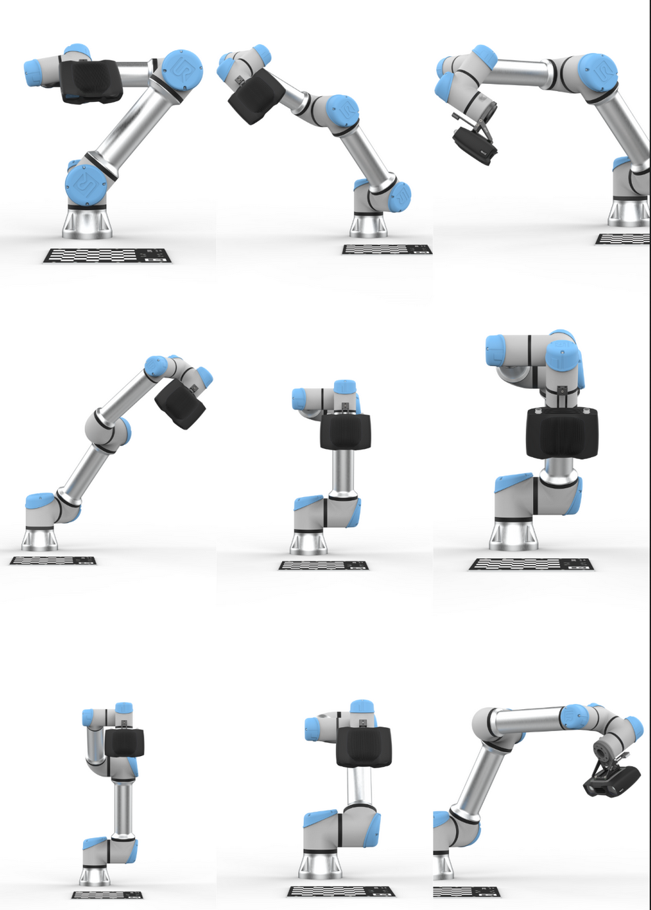

# UR5e ROS2 MoveIt2 Cartesian Control

This repository contains the complete setup for using ROS 2 Humble and MoveIt 2 to control a real UR5e robot arm with Cartesian path planning.

## Environment Setup

### 1. Clone UR ROS 2 Packages

```bash
cd ~/ur5e_ws/src
# Clone UR ROS 2 driver
git clone https://github.com/UniversalRobots/Universal_Robots_ROS2_Driver.git
# Clone UR ROS 2 description
git clone https://github.com/UniversalRobots/Universal_Robots_ROS2_Description.git
```


### 2. build
```
cd ur5e
colcon build
```
### 3. intall moveit2

Launch the MoveIt Setup Assistant:
```
cd ~/ws_moveit2/src
ros2 launch moveit_setup_assistant setup_assistant.launch.py verbose:=true
```
### 4. moveit setup:

Go to the moveit workspace:
cd /ws_moveit2/src
```
ros2 launch moveit_setup_assistant setup_assistant.launch.py verbose:=true
```
### 5. Run on hardware

Step 1: Network

Ensure the IP of your PC is on the same subnet as the UR5e
Example robot IP: 192.168.1.103

Step 2: Launch UR Driver

```
cd ur5e_ws
source /opt/ros/humble/setup.bash
ros2 launch ur_robot_driver ur5e.launch.py  robot_ip:=192.168.1.103 initial_joint_controller:=joint_trajectory_controller launch_rviz:=true
```

Step 3: Run External Control on UR5e Teach Pendant

Open URCaps in Program → External Control → Play Control by NC

Step 4: Launch MoveIt Control Nodes
Terminal 2:
```
cd ~/ur5e_ws
source /opt/ros/humble/setup.bash
source install/setup.bash
ros2 launch ur5e_moveit_config move_group.launch.py
```
Terminal3:
```
cd ~/ur5e_ws
source /opt/ros/humble/setup.bash
source install/setup.bash
ros2 launch ur5e_moveit_config moveit_rviz.launch.py

```
Terminal4:
```
cd ~/ur5e_ws
source /opt/ros/humble/setup.bash
source install/setup.bash
ros2 run moveit_control_pkg cartesian_control
```

## Hand eye calibration

### step 1:

run intrinsic_matrix.py to get the intrinsic matrix and distortion factor of the camera

### step 2:

move the robot arm in various poses with moveit (with ros2 launch ur5e_moveit_config moveit_rviz.launch.py) , record the end effector pose matrix with ros2 run tf2_ros tf2_echo base_link tool0, and record the object(checkerboard) pose in cam matrix with solvepnp.py (can use realsense.py to check your camera view)


### step 3:

put all the collected matrix in hand_eye_calibration.py and calculate the hand eye calibration matirx


